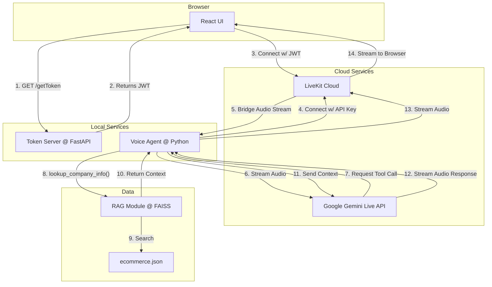

# Real-Time Voice Agent with RAG (LiveKit + Gemini Live) 🎙️

A real-time, voice-first conversational AI agent using Google Gemini, LiveKit, and a local RAG module for grounded, low-latency responses.

<p align="center">
  
  
  
  
  
  
</p>

This repository contains a voice-first conversational AI agent that uses Google's Gemini Live API for real-time speech-to-text, language understanding, and text-to-speech, with LiveKit handling the low-latency audio transport over WebRTC. A local RAG (Retrieval-Augmented Generation) module grounds the agent's responses in a specific knowledge base, ensuring it answers questions based on provided documentation.

For a detailed explanation of the RAG implementation, see [RAG_DOCUMENTATION.md](./RAG_DOCUMENTATION.md).

## Architecture Overview

The system is composed of three main parts that run concurrently:

1.  **React Frontend (`my-voice-app/`):** A simple web interface that captures microphone audio and streams it to LiveKit. It also plays back the audio stream received from the agent.
2.  **Token Server (`token_server.py`):** A lightweight FastAPI server that issues JWTs (JSON Web Tokens) to the frontend, authorizing it to connect to a specific LiveKit room.
3.  **Voice Agent (`agent.py`):** A Python worker that connects to the same LiveKit room. It receives the audio stream, forwards it to the Gemini Live API, and executes tools (like RAG lookups) when requested by the model.



## Getting Started

### Prerequisites

- Python 3.10+
- Node.js 18+ and npm 9+
- A Google AI Studio API key.
- A LiveKit Cloud project.

### Installation & Setup

1.  **Clone the repository:**
    ```powershell
    git clone https://github.com/Youssef-Ashraf-Dev/Voice-Agent.git
    cd Voice-Agent
    ```

2.  **Install dependencies:**
    ```powershell
    # Set up Python virtual environment
    python -m venv .venv
    .\.venv\Scripts\Activate.ps1

    # Install Python packages
    pip install -r requirements.txt

    # Install frontend packages
    cd my-voice-app
    npm install
    cd ..
    ```

3.  **Configure Environment Variables:**
    Create a file named `.env` in the root of the project directory and add your credentials. This file is ignored by Git.

    ```env
    # Get this from Google AI Studio
    GOOGLE_API_KEY=AI...

    # Get these from your LiveKit Cloud project settings
    LIVEKIT_URL=wss://<your-project-name>.livekit.cloud
    LIVEKIT_API_KEY=API...
    LIVEKIT_API_SECRET=...
    ```

4.  **Generate RAG Embeddings:**
    The first time you run the agent, it will automatically generate and cache the embeddings for the knowledge base (`data/ecommerce.json`). You can also pre-generate them with:
    ```powershell
    python -c "import rag; rag.get_stats()"
    ```
    If you modify `data/ecommerce.json`, you must delete the `embeddings_cache/` directory or run `python -c "import rag; rag.rebuild_cache()"` to force a regeneration.

## How to Run Locally

The system requires three separate terminal sessions to run correctly.

| Terminal | Command                       | Purpose                                     |
|----------|-------------------------------|---------------------------------------------|
| 1        | `python token_server.py`      | Serves the LiveKit authentication token.    |
| 2        | `python agent.py dev`         | Runs the voice agent worker.                |
| 3        | `cd my-voice-app; npm run dev` | Starts the frontend development server.     |

Once all three processes are running:
1.  Open your browser to `http://localhost:5173`.
2.  Click the "Start Voice Chat" button.
3.  Allow microphone access when prompted.
4.  Start speaking. The agent will listen and respond.


## Demo Video
[Watch the Voice Agent Demo on Google Drive](https://drive.google.com/file/d/19728Tg93G-Bum3YRpg5j6uoFyxe1Emtt/view?usp=sharing)
